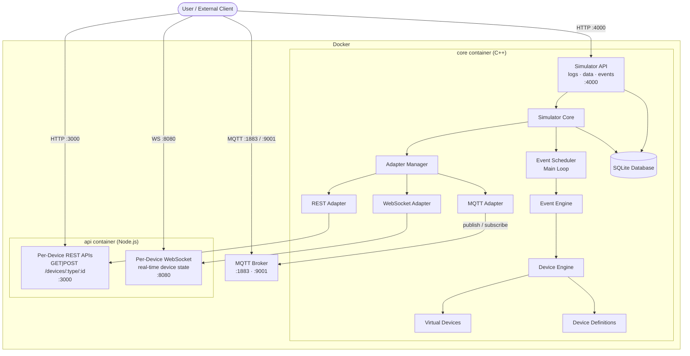

```mermaid
graph TD

    USER([User / External Client])

    CORE[Simulator Core]
    SCHED[Event Scheduler<br>Main Loop]
    EVENT_ENGINE[Event Engine]
    DEVICE_ENGINE[Device Engine]
    DEVICES[Virtual Devices]
    ADAPTER_MANAGER[Adapter Manager]
    MQTT_ADAPTER[MQTT Adapter]
    REST_ADAPTER[REST Adapter]
    WS_ADAPTER[WebSocket Adapter]
    DEVICE_CONST[Device Definitions]
    DB[(SQLite Database)]

    subgraph DOCKER["Docker"]

        subgraph CORE_CTR["core container (C++)"]
            CORE
            SCHED
            EVENT_ENGINE
            DEVICE_ENGINE
            DEVICES
            ADAPTER_MANAGER
            MQTT_ADAPTER
            REST_ADAPTER
            WS_ADAPTER
            DEVICE_CONST
            DB
            SIM_API["Simulator API<br>logs · data · events<br>:4000"]
        end

        subgraph API_CTR["api container (Node.js)"]
            DEVICE_REST["Per-Device REST APIs<br>GET|POST /devices/:type/:id<br>:3000"]
            DEVICE_WS["Per-Device WebSocket<br>real-time device state<br>:8080"]
        end

        MQTT_BROKER["MQTT Broker<br>:1883 · :9001"]

    end

    USER -->|"MQTT :1883 / :9001"| MQTT_BROKER
    USER -->|"HTTP :3000"| DEVICE_REST
    USER -->|"WS :8080"| DEVICE_WS
    USER -->|"HTTP :4000"| SIM_API

    SIM_API --> CORE

    CORE --> SCHED
    SCHED --> EVENT_ENGINE
    EVENT_ENGINE --> DEVICE_ENGINE
    DEVICE_ENGINE --> DEVICES

    CORE --> ADAPTER_MANAGER
    ADAPTER_MANAGER --> MQTT_ADAPTER
    ADAPTER_MANAGER --> REST_ADAPTER
    ADAPTER_MANAGER --> WS_ADAPTER

    MQTT_ADAPTER -->|"publish / subscribe"| MQTT_BROKER
    REST_ADAPTER --> DEVICE_REST
    WS_ADAPTER --> DEVICE_WS

    DEVICE_ENGINE --> DEVICE_CONST

    CORE --> DB
    SIM_API --> DB

```

